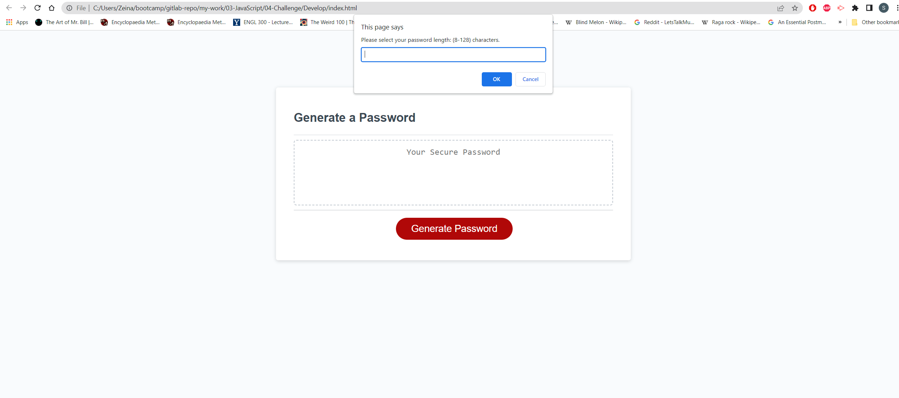
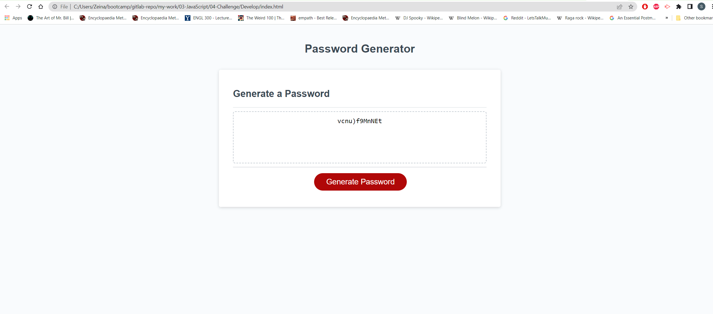

# Random Password Generator

## This project enables a user to generate a random password according to criteria they select (length and choice of character types).
It was also beneficial for learning how to utilise JavaScript to formulate a command that could be replicated.

## Installation

N/A

## Usage

The generate button, on click, will generate easy to follow prompts on the browser. when answered, the password will be generated and placed in the password box.

